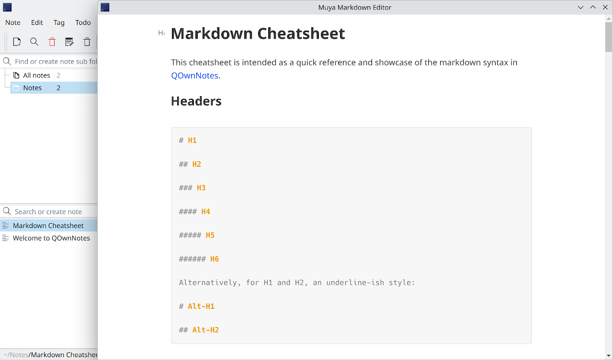

# QOwnNotes Muya Editor


> [en](README.md) | 中文

- [功能](#功能)
- [安装](#安装)
- [使用方法](#使用方法)
- [从源码构建](#从源码构建)
- [已知问题](#已知问题)
- [其它](#其它)
- [许可证](#许可证)

------



QOwnNotes Muya 编辑器是一个用于集成 Muya markdown 编辑器的 QOwnNotes 脚本。

[Muya](https://github.com/marktext/muya) 是一个面向浏览器应用的未来 Markdown 编辑器，起源于 [MarkText](https://github.com/marktext/marktext)。

此脚本创建了一个自定义操作，以启用 Muya 编辑器。如果启用，在打开笔记时会自动弹出 Muya 编辑器窗口。

> **注意：需要修改 QOwnNotes 源代码以启用 qtwebengine 才能使用此脚本！**
> 修改方法：在 `src/main.cpp` 中
> 1. 添加 `#include <QtWebEngineQuick>`
> 2. 在 `main()` 函数中的 `app()` 之前添加 `QtWebEngineQuick::initialize();`

## 功能

### 脚本功能

- 一键启用 Muya 编辑器
- 立即同步 Muya 编辑器内容到 QOwnNotes

### Muya 编辑器功能

- 实时预览 (WYSIWYG)
- Markdown 扩展，例如数学表达式 (KaTeX)、前置元数据、emojis表情符号、Mermaid、Vega-Lite 和 Plantuml 图表
- 快捷键

注意：Plantuml 依赖于在线服务 <https://plantuml.com>。

## 安装

下载最新 [Release](https://github.com/Adanelia/qownnotes-muya-editor/releases) 后解压到存放脚本的文件夹，在 QOwnNotes 中添加本地脚本，选择 `muya-editor.qml`。

## 使用方法

点击 `自定义操作 - Toggle Muya Editor` 来启用 Muya 编辑器。再次点击或关闭 Muya 编辑器窗口来禁用。

### 快捷键

#### 内联格式

- `Ctrl+b`: 加粗
- `Ctrl+i`: 斜体
- `Ctrl+u`: 下划线
- `Ctrl+d`: 删除线
- `Ctrl+Shift+H`: 高亮
- `Ctrl+e`: 行内代码
- `Ctrl+Shift+E`: 行内数学公式
- `Ctrl+l`: 链接
- `Ctrl+Shift+I`: 图片
- `Ctrl+Shift+R`: 清除所选文本的格式

#### 段落快速插入

- `Ctrl+0`: 段落
- `Ctrl+Alt+-`: 水平线
- `Ctrl+Alt+y`: 前置元数据
- `Ctrl+1`: 一级标题
- `Ctrl+2`: 二级标题
- `Ctrl+3`: 三级标题
- `Ctrl+4`: 四级标题
- `Ctrl+5`: 五级标题
- `Ctrl+6`: 六级标题
- `Ctrl+Shift+T`: 表格块
- `Ctrl+Alt+m`: 数学公式块
- `Ctrl+Alt+j`: HTML 块
- `Ctrl+Alt+c`: 代码块
- `Ctrl+Alt+q`: 引用块
- `Ctrl+Alt+o`: 有序列表
- `Ctrl+Alt+u`: 无序列表
- `Ctrl+Alt+x`: 待办事项列表

#### 段落操作

- `Ctrl+Shift+P`: 复制
- `Ctrl+Shift+N`: 新建段落
- `Ctrl+Shift+D`: 删除

#### 特定操作

- `Ctrl+z`: 撤销
- `Ctrl+y`: 重做

## 从源码构建

### 前提条件

安装 Node.js。

### 获取源代码

```sh
git clone https://github.com/Adanelia/qownnotes-muya-editor.git --recursive
```

### 编译

```sh
cd src/muya/packages/core
npm install
npx webpack
cd -
mv src/muya/packages/core/lib lib/muya
```

## 已知问题

- 在关闭 QOwnNotes 之前必须先关闭 Muya 编辑器，否则下次使用时 QOwnNotes 可能会崩溃一次
- Muya 编辑器只在打开时读取笔记内容，如果在 QOwnNotes 主编辑器中编辑笔记，需要重新打开 Muya 编辑器以同步内容
- 搜索不会自动滚动到匹配项

## 其它

这个脚本使用的 Muya 是我修改的版本，主要修改了快捷键相关问题。

我不太会 QML 和 TypeScript，因此向 AI（DeepSeek）寻求了帮助。这是我第一个使用 AI 辅助的项目，希望一切顺利。

## License
MIT License.
