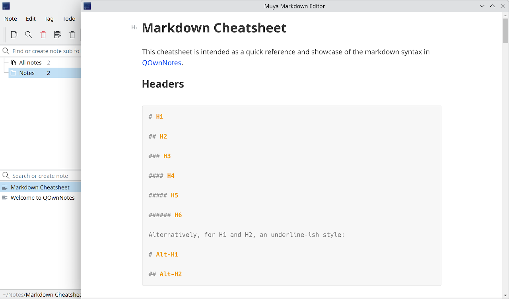

# QOwnNotes Muya Editor


> en | [中文](README-CN.md)

- [Features](#features)
- [Installation](#installation)
- [Usage](#usage)
- [Building From Source](#building-from-source)
- [Known Issues](#known-issues)
- [Other](#other)
- [License](#license)

------



QOwnNotes Muya Editor is a QOwnNotes script to integrate with Muya markdown editor.

[Muya](https://github.com/marktext/muya) is a future markdown editor for web browser applications development, originated from [MarkText](https://github.com/marktext/marktext).

This script creates a custom action to enable Muya Editor. If enabled, it will automatically pop up the Muya editor window when opening notes.

> **Note: You need to modify the QOwnNotes source code to enable qtwebengine to use this script!**
> Modification method: In `src/main.cpp`
> 1. Add `#include <QtWebEngineQuick>`
> 2. In the `main()` function, before `app()`, add `QtWebEngineQuick::initialize();`

## Features

### Script Features

- One-button enable Muya Editor
- Synchronize Muya editor content to QOwnNotes immediately

### Muya Editor Features

- Realtime preview (WYSIWYG)
- Markdown extensions such as math expressions (KaTeX), front matter, emojis and mermaid, vega-lite, plantuml diagram
- Shortcuts

Note: Plantuml relies on online service <https://plantuml.com/>.

## Installation

After downloading the latest [Release](https://github.com/Adanelia/qownnotes-muya-editor/releases) and extracting to the folder where you store scripts, add the local script in QOwnNotes by selecting `muya-editor.qml`.

## Usage

Click `Custom actions - Toggle Muya Editor` to enable Muya editor. Disable by clicking again or closing the Muya editor window.

### Shortcuts

#### Inline Format

- `Ctrl+b`: Emphasize
- `Ctrl+i`: Italic
- `Ctrl+u`: Underline
- `Ctrl+d`: Strikethrough
- `Ctrl+Shift+H`: Highlight
- `Ctrl+e`: Inline Code
- `Ctrl+Shift+E`: Inline Math
- `Ctrl+l`: Link
- `Ctrl+Shift+I`: Image
- `Ctrl+Shift+R`: Eliminate

#### Paragraph Quick Insert

- `Ctrl+0`: Paragraph
- `Ctrl+Alt+-`: Horizontal Line
- `Ctrl+Alt+y`: Front Matter
- `Ctrl+1`: Header 1
- `Ctrl+2`: Header 2
- `Ctrl+3`: Header 3
- `Ctrl+4`: Header 4
- `Ctrl+5`: Header 5
- `Ctrl+6`: Header 6
- `Ctrl+Shift+T`: Table Block
- `Ctrl+Alt+m`: Display Math
- `Ctrl+Alt+j`: HTML Block
- `Ctrl+Alt+c`: Code Block
- `Ctrl+Alt+q`: Quote Block
- `Ctrl+Alt+o`: Order List
- `Ctrl+Alt+u`: Bullet List
- `Ctrl+Alt+x`: To-do List

#### Paragraph Operate

- `Ctrl+Shift+P`: Duplicate
- `Ctrl+Shift+N`: New Paragraph
- `Ctrl+Shift+D`: Delete

#### Specific

- `Ctrl+z`: Undo
- `Ctrl+y`: Redo

## Building From Source

### Prerequisites

Install Node.js.

### Getting Source Code

```sh
git clone https://github.com/Adanelia/qownnotes-muya-editor.git --recursive
```

### Compile

```sh
cd src/muya/packages/core
npm install
npx webpack
cd -
mv src/muya/packages/core/lib lib/muya
```

## Known Issues

- Must close Muya editor before closing QOwnNotes, otherwise QOwnNotes may crash on the next use, but it should recover after that.
- Muya editor only reads the note content when opened. If you edit the note in the QOwnNotes main editor, you need to reopen Muya to sync the changes.

## Other

This script uses a modified version of Muya, which mainly adjusts shortcut issues.

I'm not very good at QML and TypeScript, so I asked for help from AI (DeepSeek). This is my first project using AI assistance, and I hope it goes smoothly.

## License
MIT License.
